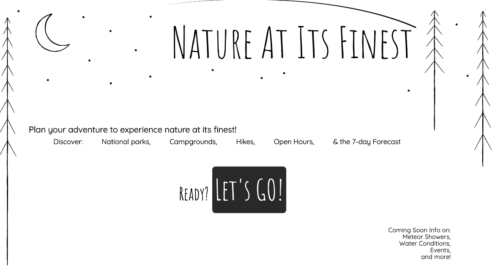

# Nature at its Finest

A single app to find help users explore nature at its finest. The interface helps users discover national parks or campgrounds in their state. From there the user can get the weather forecast and nearby hikes for each location. Need to know about accessibility information at a campground - its there. Need to know if the park will be open when you are visiting - its there.  

[emsmami.github.io/nature-at-its-finest](https://emsmami.github.io/nature-at-its-finest)

## Technologies Used

Built with
> * HTML
> * CSS
> * JavaScript
> * jQuery

Connected to 3 API's
 > * nps.gov - campgrounds endpoint & national parks endpoint
 > * weather.gov
 > * hikingproject.com

